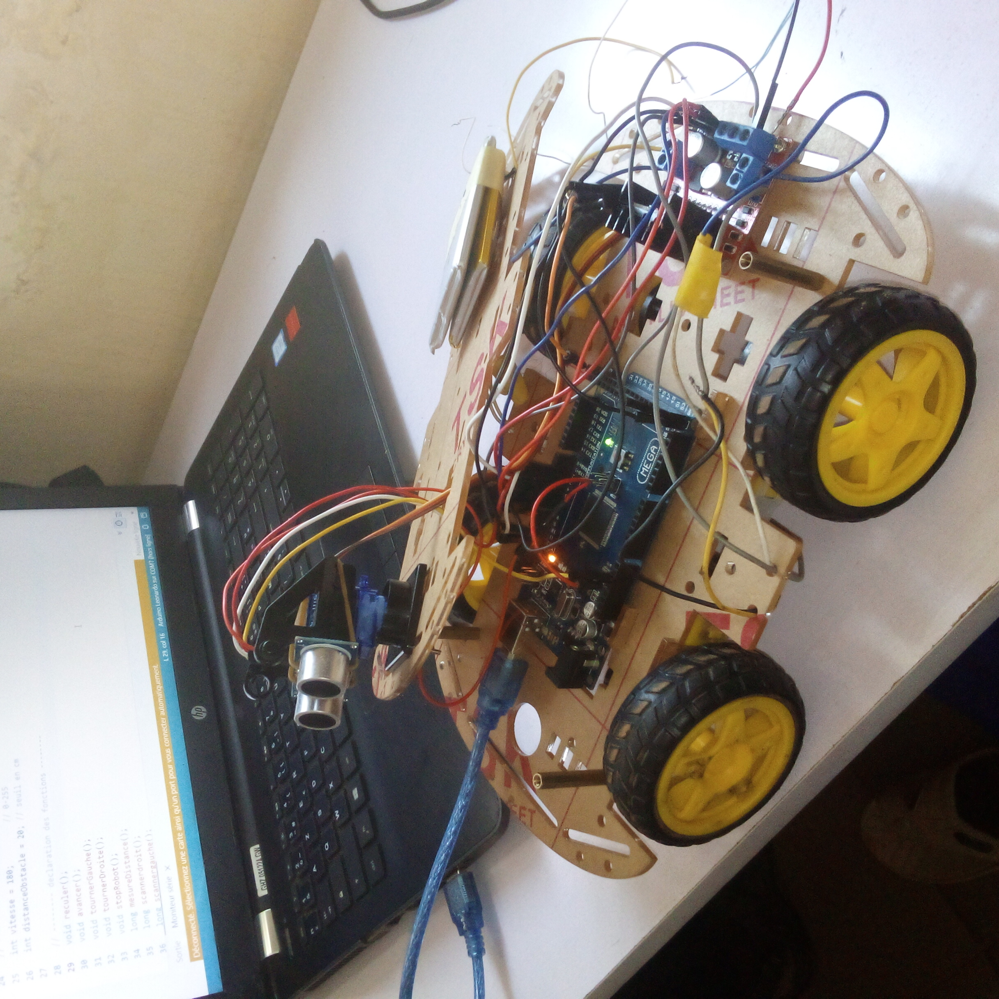

#  Robot Éviteur d'Obstacles – Arduino Uno

Ce projet présente un robot autonome basé sur **Arduino Uno** capable d'éviter des obstacles grâce à un **capteur ultrason HC-SR04**, un **servo moteur SG90** pour analyser l'espace latéralement, et un **pont en H L298N** pour contrôler deux moteurs à courant continu.

---

##  Fonctionnalités

- Détection d'obstacles à l'avant (ultrason HC-SR04)
- Mouvement avant/arrière et rotation avec moteurs DC
- Évitement intelligent en scannant à gauche et à droite (servo SG90)
- Logique de demi-tour si aucune direction n'est libre
- Affichage série des distances et actions pour débogage

---

##  Matériel Nécessaire

| Composant              | Quantité |
|------------------------|----------|
| Arduino Uno            | 1        |
| Module L298N           | 1        |
| Moteurs DC avec roues  | 2        |
| Roue folle             | 1        |
| Capteur HC-SR04        | 1        |
| Servo moteur SG90      | 1        |
| Pack de batteries (7.4V ou 6xAA) | 1        |
| Condensateur 470µF–1000µF (pour servo) | 1        |
| Breadboard, câbles     | -        |

---

##  Schéma de câblage (Résumé)

### Moteurs (via L298N)
- **Moteur gauche** : D6 (PWM), D8 (avant), D12 (arrière)
- **Moteur droit** : D11 (PWM), D2 (avant), D7 (arrière)

### Capteur HC-SR04
- **Trig** : D4
- **Echo** : D3

### Servo SG90
- **Signal** : D9
- **VCC (idéalement séparé)** : 5V régulé + Condensateur
- **GND** : commun avec Arduino

---

## Téléversement du code

1. Installer les bibliothèques :
   - [`Ultrasonic`](https://github.com/ErickSimoes/Ultrasonic)
   - [`Servo`](https://www.arduino.cc/en/Reference/Servo)

2. Ouvrir le fichier `.ino` avec l’IDE Arduino

3. Sélectionner :
   - Carte : `Arduino Uno`
   - Port : Port COM de votre carte

4. **Téléverser** le code et ouvrir le **moniteur série (9600 bauds)** pour voir les messages.

---

##  Astuces

- Ajuster les **valeurs de vitesse** des moteurs si le robot ne va pas droit.
- Utiliser une **alimentation externe stable** (batterie 7.4V) pour éviter les chutes de tension dues au servo.
- Ajouter un **switch on/off** sur le + de la batterie.

---

##  Aperçu 

---

##  Évolutions possibles

- Ajout de capteurs infrarouge pour le suivi de ligne
- Ajout d’un buzzer pour signal sonore
- Communication Bluetooth ou Wi-Fi
- PID pour trajectoire rectiligne

---

##  Licence

Projet open-source sous licence MIT – à modifier et adapter librement.
